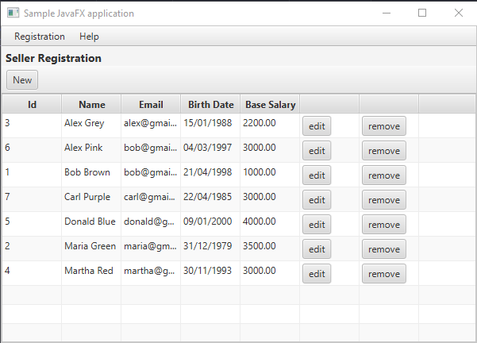
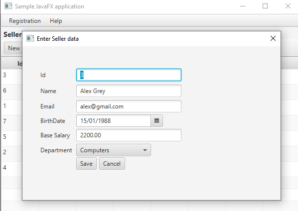
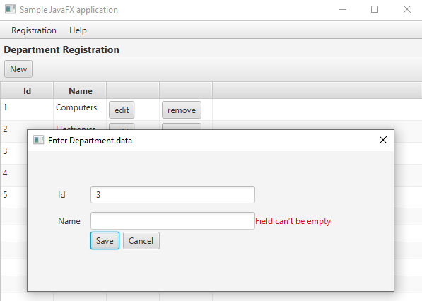

# Workshop FX

It's example usage of javaFX in a desktop app. It operate on Seller list stored in database and do stuff like adding, editing or updating. Repository contains also basic Database Abstraction Layer to convert objects into SQL commands.

## Screenshots
Seller homepage                |
:-------------------------:|
  |

Seller data           |  Department data
:-------------------------:|:-------------------------:
  |  

## Libraries used
* JavaFX Gluon
* Connector/J (JDBC)

## Technology used
* JavaFX

## Requirements
* Java version 11 or higher.
* IDE like Eclipse or other.
* MySQL database.

## Installation
1. Download the repository files (project) from the download section or clone this project by typing in the bash the following command:

       git clone https://github.com/yihongz/workshopfx-jdbc.git
2. Open it in Eclipse and don't forget to download the libraries used (montioned above).
3. Import & execute the SQL queries from the Database folder to the MySQL database.
4. Run the application :D

## License
This project is under the [MIT Licence](https://raw.githubusercontent.com/yihongz/workshopfx-jdbc/master/LICENSE)

## Contributing
If you want to contribute to this project and make it better with new ideas, your pull request is very welcomed.
If you find any issue just put it in the repository issue section, thank you.
